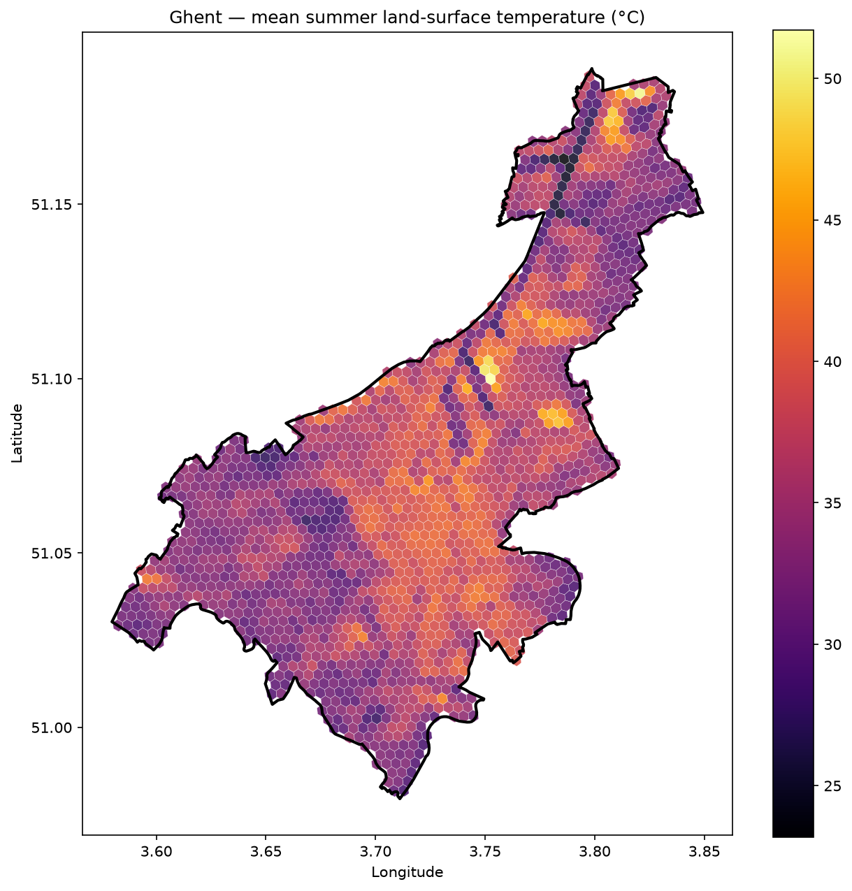
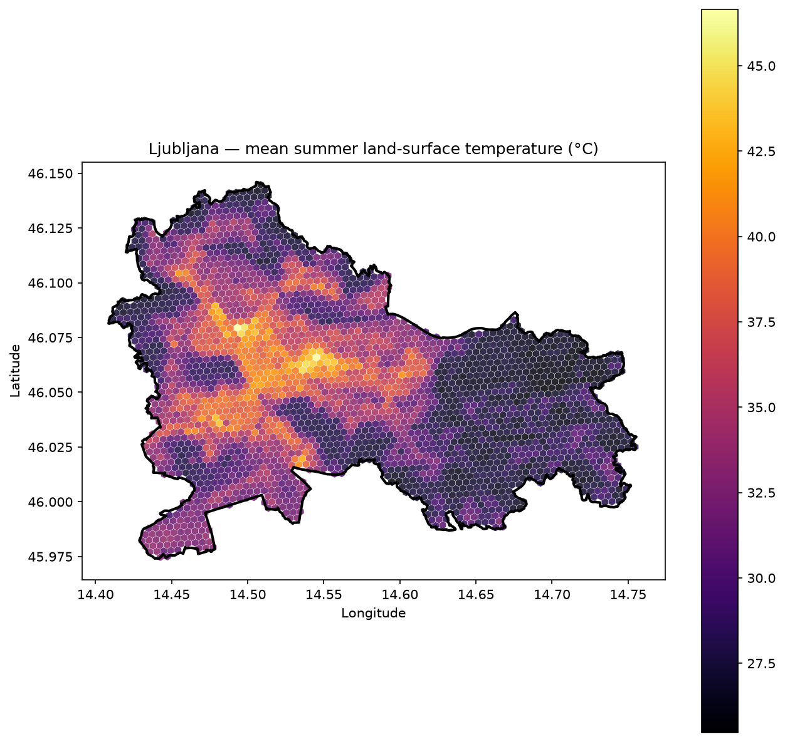
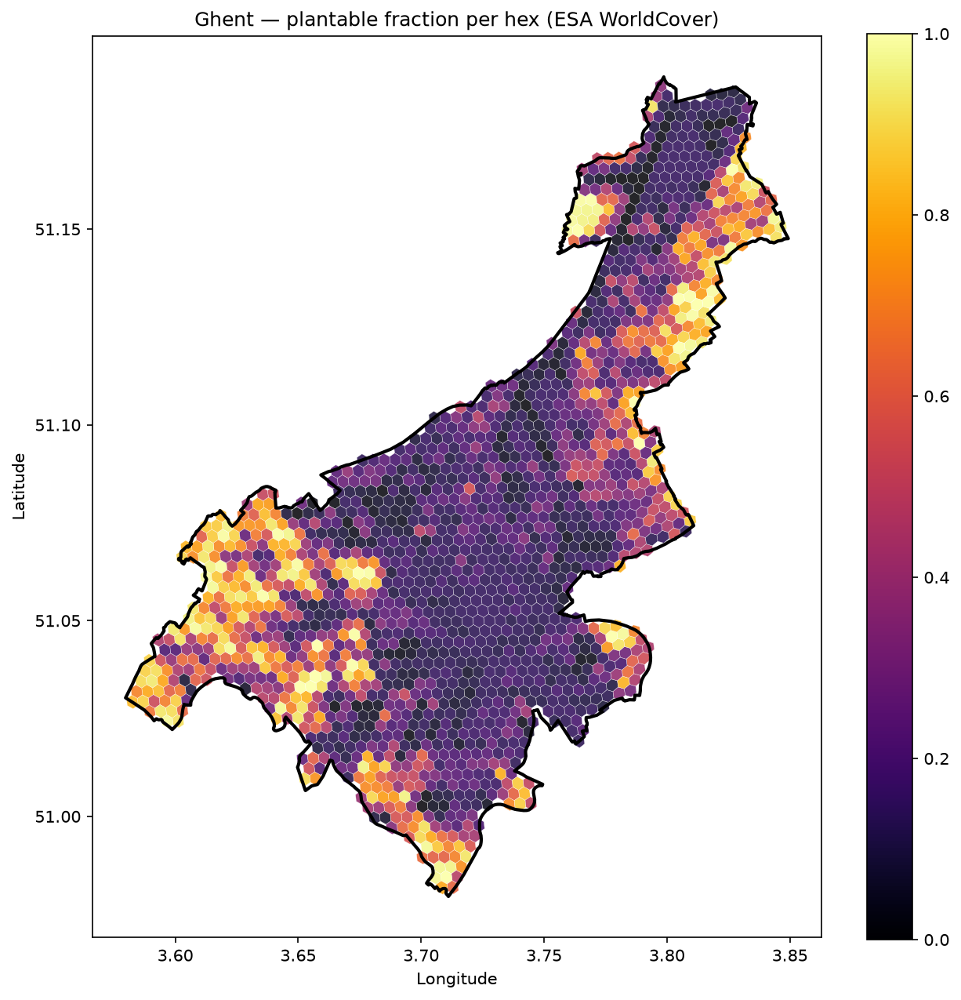
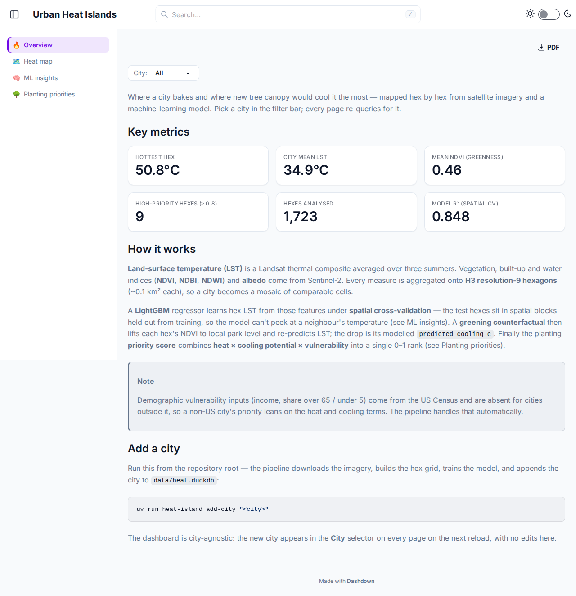
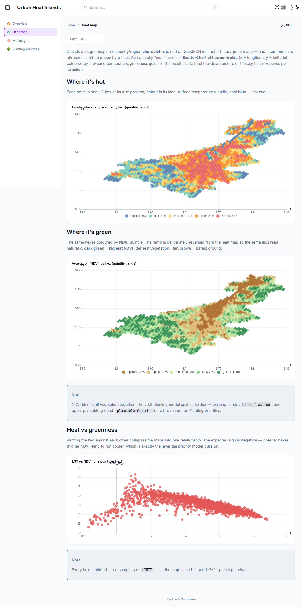
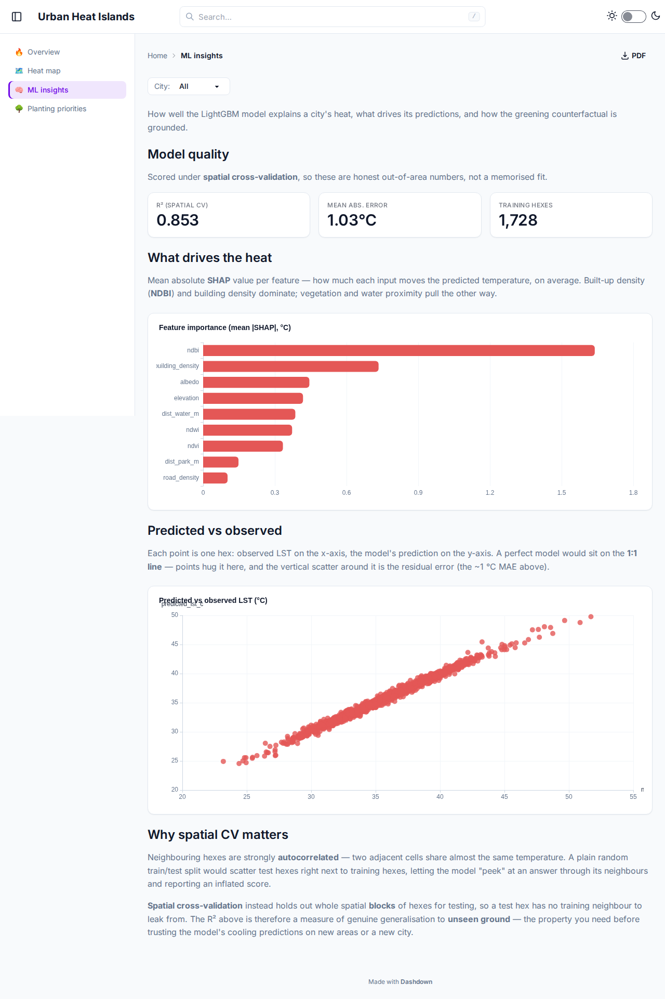
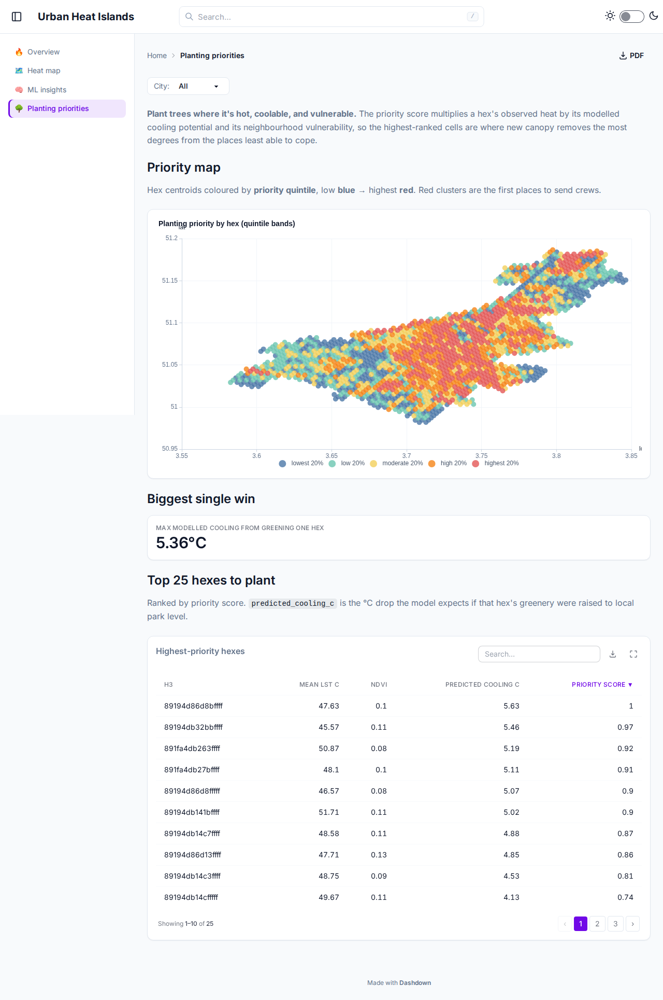

# heat-island 🌡️🌳

Map urban heat islands for **any city in the world**, use machine learning to predict where
tree planting would cool the city most, and explore the results in a
[Dashdown](https://pypi.org/project/dashdown-md/) dashboard.

Everything runs on **free, keyless data**:

| Layer | Source | Access |
| ----- | ------ | ------ |
| Land surface temperature | Landsat 8/9 Collection 2 Level-2 (`ST_B10`/`lwir11`) | [Microsoft Planetary Computer](https://planetarycomputer.microsoft.com/) STAC, no key |
| Vegetation / built-up / water / albedo | Sentinel-2 L2A (NDVI, NDBI, NDWI, visible-band albedo proxy) | Planetary Computer STAC, no key |
| Elevation | Copernicus DEM GLO-30 | Planetary Computer STAC, no key |
| Buildings, roads, water bodies, parks | OpenStreetMap | Nominatim + Overpass, no key |
| Demographics (US cities only, optional) | Census ACS 5-year + TIGERweb | keyless (optional `CENSUS_API_KEY` env var raises rate limits) |

## How it works

1. **Boundary** — the city name is geocoded with Nominatim (via OSMnx) and its administrative
   polygon fetched. Works for any city worldwide; no US-specific geometries anywhere in the
   core pipeline.
2. **Hex grid** — the polygon is tiled with [H3](https://h3geo.org/) hexagons (resolution 9,
   ~0.1 km², configurable), so every city becomes comparable.
3. **Heat** — Landsat surface temperature scenes from the last 3 summers (hemisphere-aware,
   < 20 % cloud) are cloud-masked with `QA_PIXEL`, converted to °C
   (`DN × 0.00341802 + 149.0 − 273.15`), median-composited, and averaged per hexagon.
4. **Surface features** — a cloud-masked (SCL) Sentinel-2 median composite yields NDVI, NDBI,
   NDWI and a visible-band albedo proxy per hexagon (with the processing-baseline ≥ 04.00
   reflectance offset handled); Copernicus DEM adds elevation; OSM adds building footprint
   density, road density, distance to large water, and distance to parks.
5. **Plantable space** — ESA WorldCover 10 m land cover gives each hexagon a
   `plantable_fraction`: grass, shrub, crop and bare ground count fully, built-up land gets a
   small street-pit/depaving credit (0.15), and water/wetland/existing forest count zero
   (already-canopied land offers no *additional* planting room). `tree_fraction` records the
   existing canopy share.
6. **Model** — a LightGBM regression predicts hexagon LST from the 9 surface/urban-form
   features. Validation uses **spatial block cross-validation** (GroupKFold over coarser H3
   parent cells) so spatial autocorrelation can't leak between folds. SHAP values explain
   what drives the heat.
7. **Greening counterfactual (plantability-constrained)** — the greening target is the 75th
   percentile NDVI of the city's park hexagons (cities with < 20 park hexes fall back to the
   90th percentile of all NDVI). Each hexagon closes the gap to that target **only in
   proportion to its plantable fraction** — a fully-built block can't be modeled as a park,
   and water or solid forest can't cool further. The re-predicted LST drop, floored at zero,
   is `predicted_cooling_c`; `cooling_uncertainty_c` reports its spread across the spatial-CV
   fold models.
8. **Priority score** — `heat percentile × normalized achievable cooling × vulnerability`
   (vulnerability uses income/age demographics for US cities, defaults to 1 elsewhere),
   normalized to [0, 1]. Plantability enters through the constrained cooling itself, so
   unplantable hexes rank at exactly zero.
9. Everything lands in one DuckDB file (`data/heat.duckdb`) that the Dashdown dashboard reads.

## Quick start

```bash
# 1. pipeline (uv-managed)
uv sync
uv run heat-island preview "Ghent, Belgium"     # sanity check: boundary + hex grid plot
uv run heat-island add-city "Ghent, Belgium"    # full pipeline (~10-20 min on first run)
uv run heat-island add-city "Ljubljana"         # any city — one command each
uv run heat-island list-cities

# 2. dashboard
uv tool install dashdown-md
cd dashboard && dashdown serve                  # → http://127.0.0.1:8000
```

Re-running `add-city` is fast: satellite composites and OSM responses are cached under
`data/cache/<city_id>/`. Use `--force` to refetch, `--resolution 8` for a coarser/faster grid.

### CLI

| Command | What it does |
| ------- | ------------ |
| `heat-island add-city "<city>"` | full pipeline → upsert into `data/heat.duckdb` |
| `heat-island list-cities` | processed cities with model metrics |
| `heat-island remove-city <city_id>` | delete a city's rows (cache kept) |
| `heat-island preview "<city>"` | boundary + hex grid sanity plot, no downloads |

## Publish to GitHub Pages

The dashboard exports to a fully static site (`dashdown build`): every query is
pre-rendered, `pages/cities/[city_id].md` emits **one standalone snapshot page per
processed city** (filter controls need the live server, so the static export links a
city directory instead of a dropdown), and any **AI commentary is baked at build time**.

The build runs in CI (`.github/workflows/pages.yml`) against the committed
`data/heat.duckdb`, so publishing is just:

```bash
uv run heat-island add-city "<city>"        # (re)process cities → data/heat.duckdb
git add data/heat.duckdb && git commit -m "add <city>" && git push
```

Every push to `main` touching `dashboard/**` or the DuckDB rebuilds and redeploys the
site at `https://<owner>.github.io/<repo>/` (the export is subpath-safe).

> **One-time setup (repo admin):**
> 1. **Settings → Pages → Build and deployment → Source: "GitHub Actions"** — org
>    policies usually block the workflow token from creating the Pages site itself
>    (`Resource not accessible by integration`).
> 2. **Settings → Environments → `github-pages` → Deployment branches** — make sure
>    `main` is allowed (the auto-created rule pins whatever branch was default when
>    Pages was first enabled).
> 3. *(optional, enables AI commentary)* **Settings → Secrets and variables → Actions**
>    → add `MISTRAL_API_KEY`. Without it the site builds fine; AI cards show a muted
>    "commentary not available" note.

## Dashboard

The Dashdown project in `dashboard/` serves four pages, each with a **city selector** — every
processed city is instantly explorable, and adding a brand-new one is a single
`heat-island add-city` away:

- **Overview** — headline counters (hottest hex, city mean LST, mean NDVI, plantable share,
  high-priority hex count, hexes analysed, model R²), a method explainer, and an AI read-out
  of the selected city.
- **Heat map** — **zoomable hex-polygon maps** (wheel to zoom, drag to pan — a custom
  ECharts component drawing the real H3 geometries) of surface temperature and vegetation,
  plus the LST-vs-NDVI relationship with AI explain.
- **ML insights** — SHAP feature importance, spatial-CV R²/MAE/n_train counters,
  predicted-vs-actual scatter, and AI commentary on what drives the heat.
- **Planting priorities** — zoomable priority and plantable-space maps, a top-25 table of
  where trees pay off most, and an AI "where to plant first" summary.

Charts carry Dashdown's `explain` sparkle (✨) — click it for on-demand, model-annotated
commentary. All AI output is generated by Mistral via the `llm:` block in
`dashboard/dashdown.yaml`, cached, and clearly badged as AI-generated; without an API key
everything else works and the AI cards show a muted note.

## Example results

Two cities processed with the identical, unmodified pipeline:

| City | Hexes | Summer LST (min/mean/max °C) | Spatial-CV R² | MAE °C | Plantable / existing canopy | Max achievable cooling |
| ---- | ----- | ---------------------------- | ------------- | ------ | --------------------------- | ---------------------- |
| Ghent, Belgium | 1753 | 23.2 / 35.5 / 51.7 | 0.865 | 1.04 | 0.34 / 0.28 | 3.5 ± 1.0 °C |
| Ljubljana, Slovenia | 2559 | 25.5 / 31.6 / 46.7 | 0.953 | 0.69 | 0.29 / 0.57 | 2.1 ± 0.2 °C |

(“Max achievable cooling” is plantability-constrained; the unconstrained v0.1 figures were
4.9 °C and 4.6 °C — the constraint bites hardest where the apparent potential sat on water
or land that is already forest, e.g. over half of Ljubljana.)

The Landsat composite resolves the classic heat-island anatomy — hot dense core and
industrial port corridor, cool canals and green periphery:

<p align="center">
  
  
</p>

…and ESA WorldCover shows where new canopy can physically go — the two layers together are
what the priority score ranks (hot **and** plantable):

<p align="center">
  
</p>

## Screenshots

| | |
| --- | --- |
|  |  |
|  |  |

## DuckDB schema (the pipeline ↔ dashboard contract)

```
cities(city_id, name, country, centroid_lat, centroid_lon, processed_at, n_hexes)
hexes(city_id, h3, lat, lon, geometry_wkt, mean_lst_c, ndvi, ndbi, ndwi, albedo,
      elevation, building_density, road_density, dist_water_m, dist_park_m,
      plantable_fraction, tree_fraction,
      median_income, pct_over_65, pct_under_5,
      predicted_lst_c, predicted_cooling_c, cooling_uncertainty_c, priority_score)
model_metrics(city_id, r2, mae, n_train, trained_at)
feature_importance(city_id, feature, mean_abs_shap)
```

## Project layout

```
src/heat_island/      # pipeline: boundary, hexgrid, satellite, osm_features,
                      #           demographics, features, model, simulate, db, cli
tests/                # offline unit tests (indices, scoring, schema contract)
data/                 # heat.duckdb + per-city caches (gitignored)
dashboard/            # dashdown project (pages/, sources.yaml)
ARCHITECTURE.md       # binding module contract
```

Run the tests with `uv run pytest`.

## Caveats & honest limitations

- **LST ≠ air temperature.** Landsat measures skin/surface temperature on clear summer
  mid-mornings; it exaggerates rooftop/asphalt extremes relative to what a pedestrian feels,
  but ranks hot spots well.
- **The greening counterfactual is model-based, not causal.** The model learns *cross-sectional*
  associations between greenness and heat; the counterfactual applies them within a hex. The
  plantability constraint keeps it inside physically possible feature combinations (a built
  block can no longer be modeled as a park, water and existing forest are excluded), and
  `cooling_uncertainty_c` exposes the ensemble spread — but the estimate still inherits the
  model's blind spots (irrigation, building shade, species choice) and is a *screening*
  number, not an engineering prediction.
- **The street-pit credit is an assumption.** Built-up land counts as 15 % plantable
  (`PLANTABLE_CLASS_WEIGHTS` in `config.py`); dense-core rankings are sensitive to that one
  transparent, configurable number.
- **Albedo is a crude proxy** (mean visible reflectance), not a BRDF-corrected product.
- Cities whose OSM coverage is thin will have noisier building/road features.
- Tropical cities (|lat| < 10°) composite over whole years instead of "summer".

## License

MIT — data sources retain their own licenses (Landsat/Sentinel: public domain / open;
OSM: ODbL; Census: public domain).
